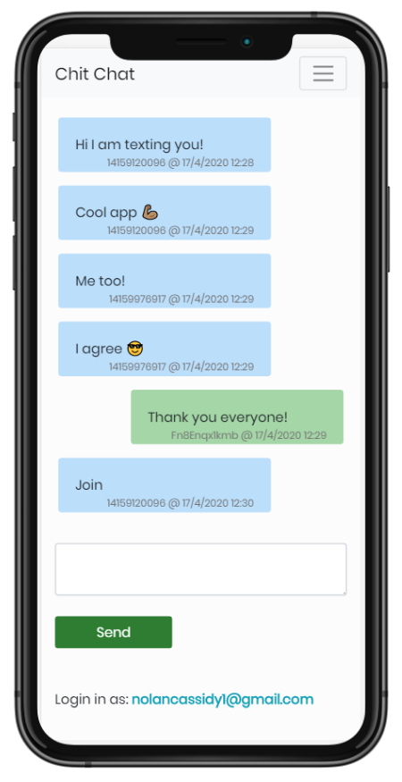
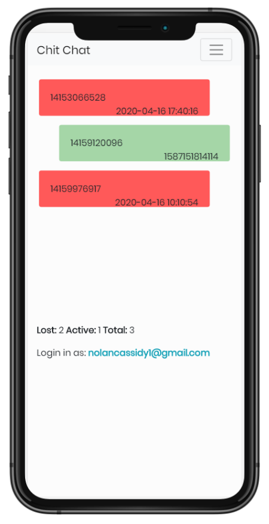
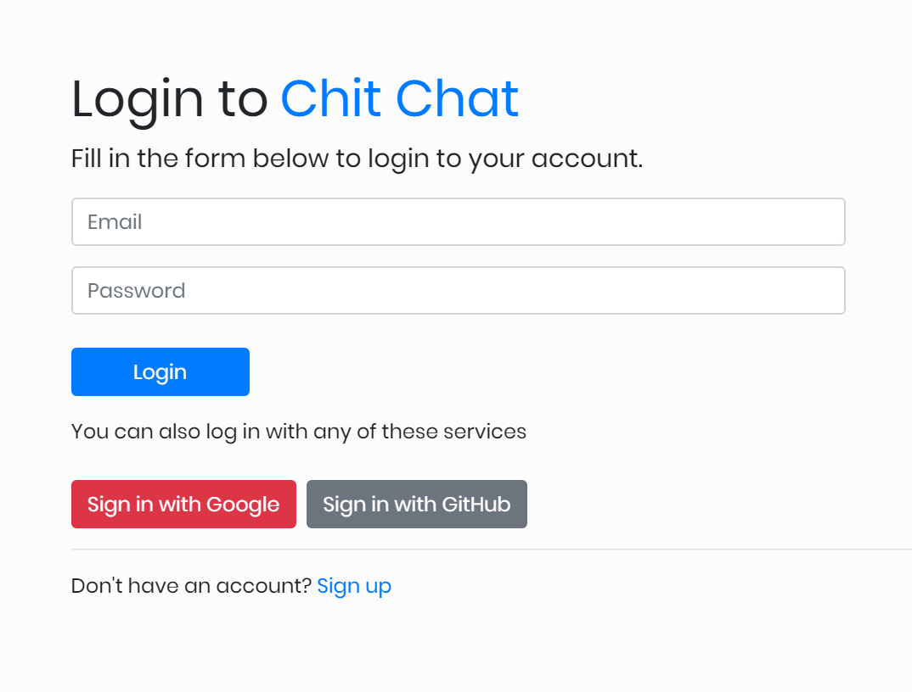

# Chit Chat Services
> This is a SMS Marketing web app that can bulk sms, user authentication, one to one chats, subscriptions, and auto reply to texts.
[https://www.chitchat.services](https://www.chitchat.services)





## Features

* User Authentication
* Real Time Chats
* SMS Subscription
* Bulk SMS
* Single SMS
* Admin accounts
* Auto SMS Replies

##Frameworks

NodeJS
ReactJS
ExpressJS
Firebase Realtime Database
Firebase Cloud Functions
Heroku Production Deploy Ready


## Usage

When running on your local device you may use dev or heroku  

```sh
yarn run-dev
or
heroku local web
```

To deploy changes to heroku

```sh
git add .
git commit -m "Add files"
heroku login
git push heroku master
```
## Set up

Follow these steps then yarn install inside the folders with package.json:
* Head over to the Firebase Console, you must have a google account.
	* Click the “Add project” option.
	* Next, let’s enter a name for the project.
	* You can choose to add analytics to your project, but it’s not required. Either way, click continue to proceed and Firebase will take a few seconds to delegate resources for the project.
	* We have to get the configuration details down for our project. So, click on the web icon in the dashboard. Then, enter a name for the app and click Register app.
	* Next up, we’ll copy and store the configuration details on the next screen in a safe place. That will come in handy in the next step.
* We need to enable these from the Authentication tab in the dashboard.
	* There’s a Sign-in method tab in the Firebase dashboard. Click the Email/Password option and enable it.
	* Firebase allows us to authenticate users with a valid Google account. We’ve got to enable it in the Firebase dashboard just like we did for email and password.
	* We’re going to do the same thing with GitHub. You will notice both the client ID and client secret fields are empty, but we do have our authorization callback URL at the bottom. Copy that  and register it with a new github app. Once that’s done, we’ll get a client ID and secret which we can now add to the Firebase console.
	* On that same page, we also need to scroll down to add a domain to the list of domains that are authorized to access features. This way, we avoid spam from any domain that is not whitelisted. For development purposes, our domain is localhost, but later this will be custom domain or heroku.
* From here, let’s add some code to src/services/firebase.js so the app can talk with Firebase. We’ll import and initialize Firebase using the configuration details we copied earlier when registering the app in the Firebase dashboard. Add firebase credentials to these files: services/firebase, server.js
* For this app, we’ll use the Firebase Realtime Database. So make sure the db is initialized.
	* Firebase database rules are defined as key-value pairs as well. Here, we’ll set our rules to allow only authenticated users to read and write to the chat node.
```sh
{"rules":{"chats":{".read":"auth!=null",".write":"auth!=null"},
"subscribers":{".read":"auth!=null",".write":"auth!=null"}}}
```
* Next we set up the Firebase Functions for incoming messages.
	* Cd into firebase-server
	* npm install firebase-functions@latest firebase-admin@latest --save
	* npm install -g firebase-tools
	* firebase login
	* firebase init functions
		* Say no to rewriting all files but yes to npm install
	* firebase deploy --only functions
* Now for connecting Nexmo.
	* Buy a phone number
	* Inside of the Nexmo settings we will post our firebase function link for incoming addMessage and place it inside of the inbound messages api.
A	* dd nexmo credentials to these files: firebasefunctions/index.js, services/nexmo, server.js

## Meta

Nolan Cassidy

[https://github.com/NolanCassidy/chitchat](https://github.com/NolanCassidy/chitchat)
